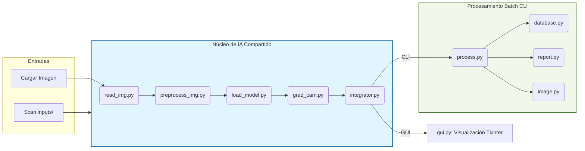

# 🏥 Sistema de Detección Inteligente de Neumonia (UAO)


Este proyecto es una herramienta avanzada de asistencia diagnóstica basada en **Deep Learning**. Su objetivo es procesar radiografías de tórax para identificar automáticamente signos de neumonía, clasificándolas en tres categorías: **Bacteriana, Viral o Normal**. 

El sistema combina potencia visual (GUI) con capacidades de procesamiento por lotes (Docker/CLI), utilizando la arquitectura de red neuronal **WilhemNet86** y mapas de calor **Grad-CAM** para ofrecer interpretabilidad médica al resaltar las zonas de la imagen que determinaron el diagnóstico.

---

## 📋 Requisitos Mínimos Previos

Antes de comenzar, asegúrese de tener instaladas las siguientes herramientas en su sistema (Windows recomendado):

1.  **Chocolatey** (Gestor de paquetes para Windows): 
    *   [Instalar aquí](https://chocolatey.org/install) (Requiere PowerShell como Administrador).
2.  **Make**: 
    ```bash
    choco install make
    ```
3.  **UV** (Gestor de paquetes y entornos Python ultrarrápido):
    ```bash
    powershell -ExecutionPolicy ByPass -c "irm https://astral.sh/uv/install.ps1 | iex"
    ```
4.  **Docker Desktop** (Opcional, solo para despliegue en contenedores).

---

## 🚀 Instalación y Puesta en Marcha

Siga estos pasos para configurar el proyecto en su máquina local:

### 1. Clonar el Repositorio
```bash
git clone https://github.com/jhonattangarcia-rgb/proyectoNeumoniaUAO.git
cd proyectoNeumoniaUAO
```

### 2. Gestión del Modelo de IA (.h5) ⚠️ **IMPORTANTE**
Debido a su tamaño, el archivo del modelo entrenado (`conv_MLP_84.h5`) **no se encuentra en el repositorio de GitHub**.
*   **Acción requerida:** Solicite el archivo `.h5` al equipo de desarrollo o descárguelo desde el enlace oficial proporcionado.
*   **Ubicación:** Copie el archivo `conv_MLP_84.h5` directamente en la **raíz del proyecto**. El sistema no funcionará sin este archivo.

### 3. Configuración del Entorno
Utilice el comando `make` para preparar todo automáticamente (esto descargará las librerías necesarias):
```bash
make install
```

---

## 💻 Aplicación de Escritorio (GUI)

Para lanzar la interfaz visual interactiva, ejecute:
```bash
make run
```

### Funcionalidades Disponibles:
*   **Carga de Imagen:** Soporta formatos médicos **DICOM** (.dcm) y formatos estándar (**JPG, PNG**).
*   **Predicción Instantánea:** Clasifica la imagen y genera el mapa Grad-CAM en segundos.
*   **Gestión de Datos:** Ingrese la cédula del paciente y use el botón **Guardar** para registrar el resultado en el histórico local (`historial.csv`).
*   **Reportes PDF:** El botón **PDF** genera un informe profesional que incluye la radiografía original, el mapa de calor y el diagnóstico detallado.

---

## Uso de la Interfaz Gráfica

1. Ingrese la cédula del paciente en la caja de texto
2. Presione **Cargar Imagen** y seleccione una imagen DICOM, JPG o PNG
3. Presione **Predecir** y espere los resultados
4. Presione **Guardar** para exportar los datos del paciente en formato CSV
5. Presione **PDF** para descargar el informe
6. Presione **Borrar** para cargar una nueva imagen

Imágenes de prueba disponibles en:
https://drive.google.com/drive/folders/1WOuL0wdVC6aojy8IfssHcqZ4Up14dy0g

---


## 📂 Estructura del Proyecto

```text
D:\UAO-Neumonia\
├── app/                        # Núcleo de la aplicación
│   ├── cli/                    # Módulo para procesamiento por lotes (Docker)
│   │   ├── cli.py              # Definición de comandos Click
│   │   ├── database.py         # Manejo de Excel/Pandas
│   │   ├── image.py            # Utilidades de guardado de imágenes
│   │   ├── process.py          # Lógica de procesamiento por lotes
│   │   ├── report.py           # Generador de reportes PDF (CLI)
│   │   └── utils.py            # Utilidades de consola
│   ├── grad_cam.py             # Generación de mapas de calor
│   ├── gui.py                  # Interfaz gráfica (Tkinter)
│   ├── integrator.py           # Orquestador de predicciones
│   ├── load_model.py           # Cargador del modelo Keras
│   ├── preprocess_img.py       # Pipeline de preprocesamiento
│   └── read_img.py             # Lector DICOM/JPG/PNG
├── tests/                      # Pruebas automatizadas (Pytest)
├── detector_neumonia.py        # Punto de entrada principal (GUI/CLI)
├── Dockerfile                  # Receta para el contenedor Docker
├── Makefile                    # Automatización de tareas
├── pyproject.toml              # Gestión de dependencias (UV)
├── uv.lock                     # Lockfile de dependencias
├── Manual.md                   # Documentación de usuario
└── conv_MLP_84.h5              # [MANUAL] Modelo de red neuronal
```
## 🔄 Flujo de Datos y Arquitectura

El sistema utiliza un núcleo de procesamiento compartido (Core) optimizado para ejecutarse de forma interactiva (GUI) o masiva (Docker/CLI). El siguiente diagrama describe el recorrido de la información:


---

## 🛠️ Descripción de Módulos

### Núcleo (Core)
*   **`read_img.py`**: Motor de lectura multiformato. Traduce archivos DICOM, JPG y PNG a matrices numéricas (NumPy) compatibles con el modelo.
*   **`preprocess_img.py`**: Pipeline de visión artificial. Aplica redimensionamiento (512x512), ecualización de histograma (CLAHE) y normalización.
*   **`load_model.py`**: Gestiona la carga eficiente del modelo `conv_MLP_84.h5` en memoria.
*   **`grad_cam.py`**: Implementa el algoritmo de Grad-CAM para generar los mapas de calor de interpretabilidad.
*   **`integrator.py`**: El orquestador principal. Recibe una imagen y coordina todos los pasos anteriores para retornar el diagnóstico final.

### Aplicación y CLI
*   **`gui.py`**: Implementa la aplicación de escritorio usando Tkinter, gestionando eventos, visualización y generación de reportes individuales.
*   **`detector_neumonia.py`**: Punto de entrada dual. Detecta el entorno (Docker o Local) y decide si lanza la GUI o el motor CLI.
*   **`app/cli/cli.py`**: Define los comandos de consola (validate-paths, execute-classification, show-excel) usando la librería Click.
*   **`app/cli/process.py`**: Contiene la lógica de procesamiento por lotes, recorriendo carpetas y coordinando el guardado de cada resultado.
*   **`app/cli/database.py`**: Gestiona la persistencia en Excel (`database.xlsx`), incluyendo filtros por fecha (`delta-days`).
*   **`app/cli/report.py`**: Generador especializado de informes PDF para el flujo automático.
*   **`app/cli/image.py`** y **`app/cli/utils.py`**: Utilidades auxiliares para manejo de archivos y formato de consola.

---

## 🧪 Garantía de Calidad (Tests)

El proyecto cuenta con una suite de pruebas automatizadas con **Pytest** para asegurar la integridad de la lógica:

*   **`test_files.py`**: Valida que el sistema reconozca extensiones permitidas (.dcm, .jpg, .png) y maneje correctamente errores de archivos no encontrados.
*   **`test_models.py`**: Verifica que el archivo del modelo IA (`conv_MLP_84.h5`) esté presente en la ubicación correcta antes de iniciar.
*   **`test_preprocess.py`**: Asegura que el pipeline de preprocesamiento transforme las imágenes al formato exacto de 512x512 y tipo float32 que la red neuronal requiere.

### Cómo ejecutar las pruebas:
```bash
make test
```

## 🛠️ Automatización con Makefile

El proyecto incluye un `Makefile` para simplificar las operaciones comunes:

*   `make start`: Actualiza el código desde GitHub y sincroniza las dependencias.
*   `make run`: Ejecuta la aplicación de escritorio.
*   `make lint`: Verifica que el código cumpla con los estándares de calidad (Ruff).
*   `make test`: Ejecuta las pruebas automatizadas para asegurar que todo funcione bien.
*   `make clean`: Limpia archivos temporales y cachés para liberar espacio.

---

## 🐳 Uso con Docker (Modo CLI Profesional)

El modo Docker está diseñado para procesar grandes volúmenes de imágenes de forma automática sin intervención humana.

Este formato es ideal para usuarios sin experiencia en Python o para despliegue en entornos controlados. La aplicación se ejecuta en modo CLI dentro del contenedor, procesando las imágenes desde un volumen montado.

### Flujo de Trabajo en Contenedor:
1.  **Estructura de Carpetas:** Debe tener una carpeta en su PC (ej. `C:\DatosMedicos\data\`)  ⚠️ **IMPORTANTE** debe existir la carpeta de nombre **data** con tres subcarpetas: `inputs/`, `outputs/` y `database/`.
2.  **Nombres de Imagen:** Las imágenes en `inputs/` **deben tener nombre numérico** (ej. `12345.jpg`), este debe ser el número de cédula del paciente.

### Preparación de la Imagen Docker

En lugar de configurar todo manualmente, descargue la versión oficial pre-construida usando nuestro atajo:

```bash
make docker-pull
```

### Comandos Docker Simplificados (Vía Makefile)

Una vez descargada la imagen, puede usar los atajos del `Makefile` para gestionar el procesamiento. El sistema utilizará automáticamente la imagen descargada.

2.  **Validar su estructura de carpetas:**
    (Asegúrese de que su ruta local termine en la carpeta `data` que contiene `inputs`, `outputs` y `database`).
    ```bash
    make docker-validate DATA="(ejemplo)C:\DatosMedicos\data\"
    ```

3.  **Ejecutar el proceso de clasificación:**
    ```bash
    make docker-execute DATA="(ejemplo)C:\DatosMedicos\data\"
    ```

4.  **Ver el resumen de la base de datos (Excel):**
    ```bash
    make docker-show DATA="(ejemplo)C:\DatosMedicos\data\"
    ```

### 📂 Consulta de Resultados
Una vez finalizado el proceso de clasificación (`docker-execute`):
*   **Resultados Individuales:** Diríjase a su carpeta local `outputs/`. Encontrará una subcarpeta por cada cédula procesada conteniendo el **reporte PDF**, la imagen **Grad-CAM** y un archivo **JSON** con el detalle técnico.
*   **Historial Consolidado:** Abra el archivo `database/database.xlsx` para ver la tabla completa de pacientes procesados, probabilidades y fechas.

---

## 🧠 Acerca del Modelo y Tecnología

### WilhemNet86
La red neuronal convolucional está basada en una arquitectura de 5 bloques con conexiones skip, seguidos de pooling y capas Dense (1024, 1024, 3) con Dropout al 20%. Está diseñada para un cribado rápido y eficiente.

### Grad-CAM
Técnica de visualización que calcula el gradiente de la clase predicha respecto a la última capa convolucional, generando un mapa de calor que resalta las regiones anatómicas clave para el diagnóstico.

---

## Licencia

Este proyecto está licenciado bajo la **Licencia MIT**.
MIT License
Copyright (c) 2026 Equipo UAO - Proyecto Neumonía
Permission is hereby granted, free of charge, to any person obtaining a copy
of this software and associated documentation files (the "Software"), to deal
in the Software without restriction, including without limitation the rights
to use, copy, modify, merge, publish, distribute, sublicense, and/or sell
copies of the Software, and to permit persons to whom the Software is
furnished to do so, subject to the following conditions:
The above copyright notice and this permission notice shall be included in all
copies or substantial portions of the Software.
THE SOFTWARE IS PROVIDED "AS IS", WITHOUT WARRANTY OF ANY KIND, EXPRESS OR
IMPLIED, INCLUDING BUT NOT LIMITED TO THE WARRANTIES OF MERCHANTABILITY,
FITNESS FOR A PARTICULAR PURPOSE AND NONINFRINGEMENT.

---

## 👥 Autores y Créditos

Este proyecto es fruto del trabajo del equipo de ingeniería de la **Universidad Autónoma de Occidente**:

- **Jhonatan Garcia**
- **Andrea Mallama**
- **Francisco Quintero**
- **Jean Marco Varon**
- **Heidy Romero**

---
© 2026 Equipo UAO - Proyecto Neumonía. Licencia MIT.
