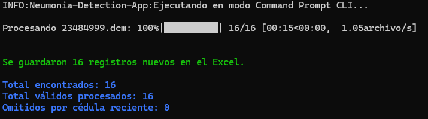

# Detección de Neumonía con IA

Herramienta de Deep Learning para clasificación automática de radiografías de tórax en formato DICOM y JPG/PNG en tres categorías:

- Neumonía Bacteriana
- Neumonía Viral
- Sin Neumonía

Utiliza Grad-CAM para generar un mapa de calor que resalta las regiones relevantes de la imagen que determinaron el diagnóstico.

---

## Arquitectura del ProyectoproyectoNeumoniaUAO/
├── app/
│   ├── read_img.py          # Lectura de imágenes DICOM, JPG y PNG
│   ├── preprocess_img.py    # Preprocesamiento de imágenes
│   ├── load_model.py        # Carga del modelo WilhemNet86.h5
│   ├── grad_cam.py          # Generación de mapa de calor
│   ├── integrator.py        # Coordinación de módulos
│   └── gui.py               # Interfaz gráfica con Tkinter
├── tests/                   # Pruebas unitarias con pytest
├── Dockerfile               # Configuración para contenedor Docker
├── pyproject.toml           # Dependencias del proyecto
└── README.md## 
## Flujo de Datos
Imagen (DICOM/JPG/PNG)
↓
read_img.py
(lectura y conversión a array RGB)
↓
preprocess_img.py
(resize 512x512 → escala de grises → CLAHE → normalización → tensor)
↓
load_model.py
(carga WilhemNet86.h5)
↓
grad_cam.py
(predicción + mapa de calor)
↓
integrator.py
(retorna clase + probabilidad + heatmap)
↓
Interfaz gráfica

---

## Requisitos Previos

- Python 3.11+
- [uv](https://docs.astral.sh/uv/) para gestión del ambiente virtual
- Docker Desktop (solo para ejecución con contenedor)

---

## Instalación y Ejecución Local

> El ambiente virtual debe crearse exclusivamente con **uv**. No usar conda, venv ni pip directamente.

**Paso 1: Clonar el repositorio**

```bash
git clone https://github.com/jhonattangarcia-rgb/proyectoNeumoniaUAO.git
cd proyectoNeumoniaUAO
```

**Paso 2: Instalar uv**

```bash
pip install uv
```

**Paso 3: Crear el ambiente virtual e instalar dependencias**

```bash
uv sync
```

**Paso 4: Activar el ambiente virtual**

```bash
# Windows
.venv\Scripts\activate

# Linux/Mac
source .venv/bin/activate
```

**Paso 5: Ejecutar la aplicación**

```bash
python app/integrator.py
```

---

## Ejecución con Docker

Esta formato es ideal para usuarios sin experiencia en Python o para despliegue en entornos controlados. La aplicación se ejecuta en modo CLI dentro del contenedor, procesando las imágenes desde un volumen montado.

<p align="center">
  
</p>

### Opción 1: Usar la imagen preconstruida

Reemplaza `WINDOWS_PATH_FOLDER` con la ruta absoluta de tu carpeta de datos en Windows (ej. `C:\Users\Usuario\Desktop\data`):

```bash
docker pull ghcr.io/baronco/app-neumonia:v0.1.0
```

Luego ejecuta el contenedor con el siguiente comando:

```bash
docker run --rm --name app-neumonia -e COMMAND_PROMPT_MODE=true -v "WINDOWS_PATH_FOLDER:/app/data" ghcr.io/baronco/app-neumonia:v0.1.0
```

### Opción 2: Construir la imagen localmente

Si deseas construir la imagen tú mismo, asegúrate de estar en el directorio raíz del proyecto y ejecuta:

```bash
docker build -t app-neumonia .
```
Luego ejecuta el contenedor con el siguiente comando:

```bash
docker run -d --name app-neumonia -e COMMAND_PROMPT_MODE=true -v "WINDOWS_PATH_FOLDER:/app/data" ghcr.io/baronco/app-neumonia:v0.1.0
```

**Comandos recomendados**

Se recomienda ejecutar estos comandos dentro del contenedor para validar la estructura de carpetas, ejecutar la clasificación por lotes y mostrar el contenido del Excel:

Ejecuta el siguiente comando para mostrar la ayuda de los comandos disponibles:

```bash
docker exec app-neumonia uv run python detector_neumonia.py --help
```

Ejecuta el siguiente comando para validar la estructura de carpetas del volumen, en caso de errores, el contenedor mostrará mensajes indicando qué carpetas faltan o están mal configuradas:

```bash
docker exec app-neumonia uv run python detector_neumonia.py validate-paths
```

Ejecuta el siguiente comando para procesar las imágenes del volumen y generar las salidas. El argumento `--delta-days` sirve para filtrar las imágenes por fecha, procesando solo aquellas que hayan sido modificadas en los últimos N días. Si no se especifica, se procesarán todas las imágenes, esto es útil pues una radiografía tomada a un paciente puede repetirse con un delta de días para actualizar su diagnóstico sin necesidad de eliminar la imagen anterior o duplicar registros en el Excel. El default es 30 días, lo que significa que se procesarán las imágenes modificadas en el último mes:

```bash
docker exec app-neumonia uv run python detector_neumonia.py execute-classification
```
Para deltas personalizados se debe usar la bandera `--delta-days` seguida del número de días deseado, por ejemplo, para procesar solo las imágenes modificadas en los últimos 30 días:

```bash
docker exec app-neumonia uv run python detector_neumonia.py execute-classification --delta-days 30
```
Ejecuta el siguiente comando para mostrar el contenido actual del archivo `database.xlsx` ubicado en el volumen. Esto es útil para verificar que los datos se están guardando correctamente después de ejecutar la clasificación por lotes:

```bash
docker exec app-neumonia uv run python detector_neumonia.py show-excel
```

### Requisitos de la estructura de carpetas del volumen
El volumen de Windows debe tener esta estructura antes de ejecutar el contenedor:

- `inputs/`: contiene las radiografías DICOM o JPEG. Los nombres de archivo deben ser numéricos. **Solo se deben agregar las imágenes a esta carpeta, no se deben crear subcarpetas dentro de inputs**.
- `outputs/`: se generarán las carpetas por cédula y se guardarán las salidas.
- `database/`: se almacenará `database.xlsx`.

Si `database/database.xlsx` no existe, el contenedor lo creará en la primera ejecución.

---

## Uso de la Interfaz Gráfica

1. Ingrese la cédula del paciente en la caja de texto
2. Presione **Cargar Imagen** y seleccione una imagen DICOM, JPG o PNG
3. Presione **Predecir** y espere los resultados
4. Presione **Guardar** para exportar los datos del paciente en formato CSV
5. Presione **PDF** para descargar el informe
6. Presione **Borrar** para cargar una nueva imagen

Imágenes de prueba disponibles en:
https://drive.google.com/drive/folders/1WOuL0wdVC6aojy8IfssHcqZ4Up14dy0g

---

## Acerca del Modelo

La red neuronal convolucional WilhemNet86 está basada en la arquitectura propuesta por F. Pasa, V. Golkov, F. Pfeifer, D. Cremers y D. Pfeifer en *Efficient Deep Network Architectures for Fast Chest X-Ray Tuberculosis Screening and Visualization*.

Está compuesta por 5 bloques convolucionales con conexiones skip para evitar el desvanecimiento del gradiente, seguidos de capas de pooling y tres capas Dense de 1024, 1024 y 3 neuronas. Utiliza Dropout al 20% para regularización.

---

## Acerca de Grad-CAM

Técnica de visualización que calcula el gradiente de la salida de la clase predicha respecto a las activaciones de la última capa convolucional. El resultado es un mapa de calor superpuesto sobre la radiografía que indica las regiones anatómicas que determinaron la clasificación.

---

## Licencia

Este proyecto está licenciado bajo la **Licencia MIT**.
MIT License
Copyright (c) 2026 Equipo UAO - Proyecto Neumonía
Permission is hereby granted, free of charge, to any person obtaining a copy
of this software and associated documentation files (the "Software"), to deal
in the Software without restriction, including without limitation the rights
to use, copy, modify, merge, publish, distribute, sublicense, and/or sell
copies of the Software, and to permit persons to whom the Software is
furnished to do so, subject to the following conditions:
The above copyright notice and this permission notice shall be included in all
copies or substantial portions of the Software.
THE SOFTWARE IS PROVIDED "AS IS", WITHOUT WARRANTY OF ANY KIND, EXPRESS OR
IMPLIED, INCLUDING BUT NOT LIMITED TO THE WARRANTIES OF MERCHANTABILITY,
FITNESS FOR A PARTICULAR PURPOSE AND NONINFRINGEMENT.
## Autores

- Jhonatan Garcia
- Andrea Mallama
- Francisco Quintero
- Jan Carlos
- Heidy
